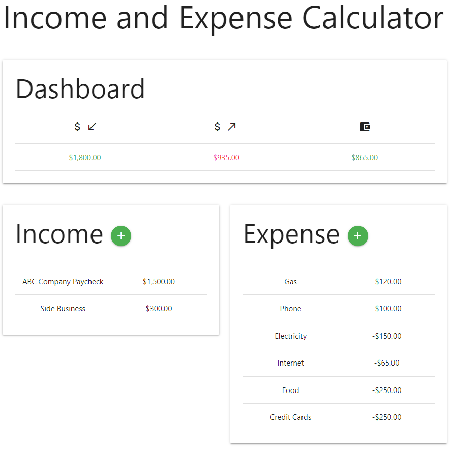

# Income and Expense Calculator

## Description

Add monthly income and expense lines to calculate your total income, expense, and leftover cash for the month.

## Features

- Add income or expense by clicking or tapping the plus (+) button next to each category.

- View total income, expense, and leftover cash for the month in the Dashboard at the top.

- Edit and delete entries as needed.

- All data is stored in the browser and persists on tab refresh.

- Colors in the dashboard indicate positive or negative values.

## Screenshot

## Live Site

[Link](https://jdpasternak.github.io/income-expense-calc)
